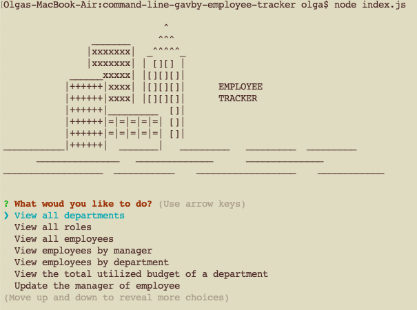

  # Employee Tracker

  

  ## Description
  
  This is a command-line application which help to manage company's employee database. it allows  view, add, update and delete records in database using intuitive interface.

  

  ## Table of Contents
 
  - [Installation](#installation)
  - [Usage](#usage)
  - [Credits](#credits)
  - [License](#license)
  - [Questions](#questions)
  - [Contribution](#contribution)
  - [Tests](#tests)
    
  ## Installation
  
  1. clone the project 
  2. setup the database from ./db/schema.sql 
  
    Note: for testing purpose you may populate db with test data:  ./db/seeds.sql
  3. run the application: node index.js 
  
  **Note:** if you observe the connection error, check the version of node. It was developed and tested with `node version 16.18.1`
  
  ## Usage
  
  - Run the application: `node index.js` 
  - Use menu options to select action you want to do:
    - View all departments
    - View all role
    - view all employees
    - View employees by manager
    - View employees by department
    - View the total utilized budget of a department
    - Update the manager of employee
    - Update the role of employee
    - Add new department
    - Add new role
    - Add new employee
    - Delete department
    - Delete role
    - Delete employee
  - Select the action you want to do, and answer the follow-up questions. 
  
  See the video instructions: `TBU`
  
  
  ## Credits
  
   - Olga Gavrushenko 
   - Learning materials [Berkley Extension: coding bootcamp](https://extension.berkeley.edu/)
   - Instructor: Robert Wijtman
  
  ## License
  
  

  This application is available under the license: MIT License. 
    See the LICENSE file for more info. Full details available by link https://choosealicense.com/licenses/mit/. 
    
 
  ## Questions
  
  Link to my GitHub profile https://github.com/olgagav/
  
  If you have additional questions or proposals please email me: [ogavby@gmail.com](mailto:ogavby@gmail.com?subject=[GitHub]%20command-line%20password%20generator)
    
  ## Contribution

Contributions are what make the open source community such an amazing place to learn, inspire, and create. Any contributions you make are greatly appreciated. 
  
  - Fork the Project 
  - Create your Feature Branch 
  - Commit your Changes 
  - Push to the Branch 
  - Open Pull Request
  
  ## Tests
  
  n/a
  
